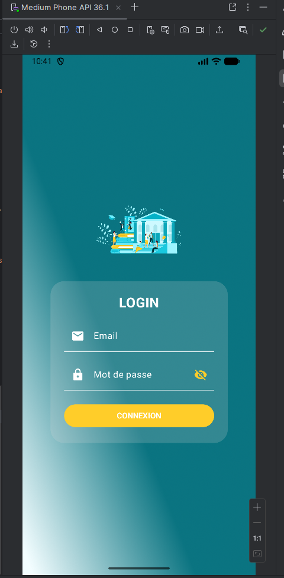
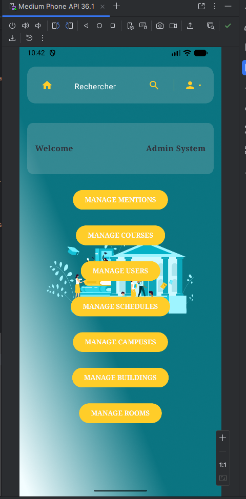
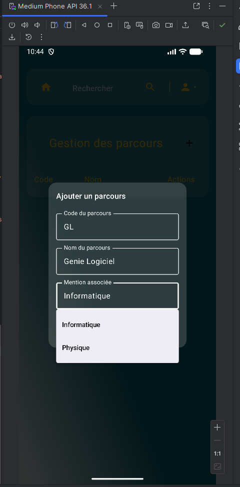
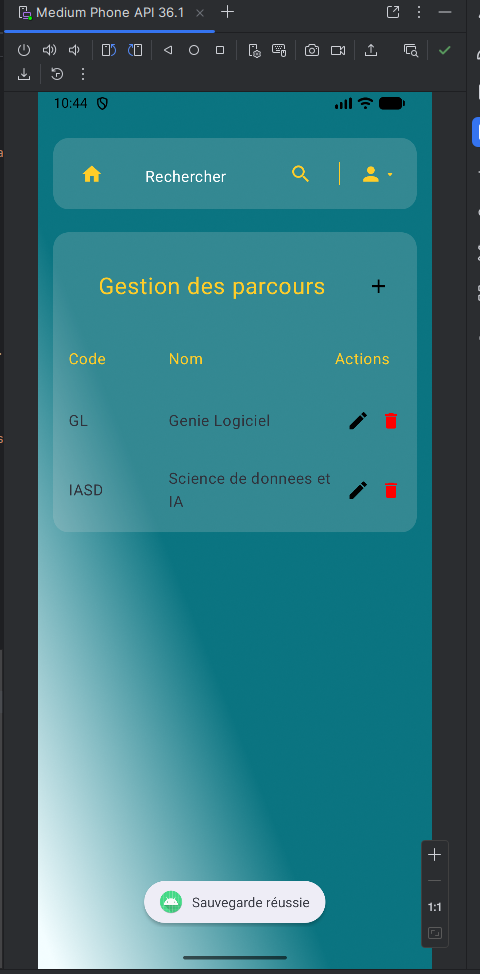
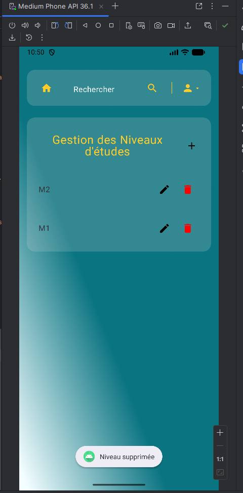
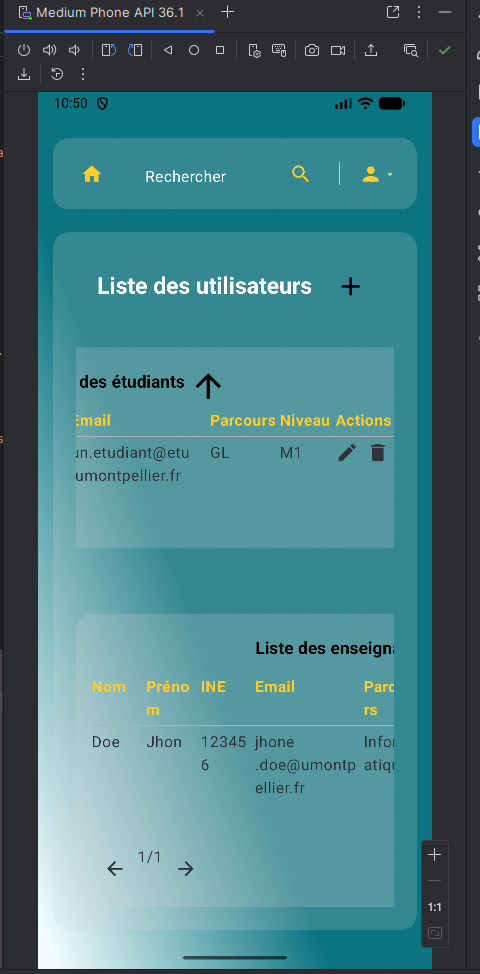
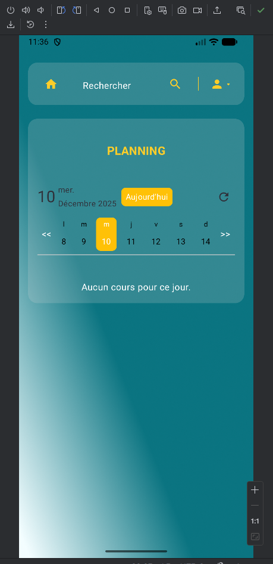

# EduConnect 🎓

EduConnect est une application de gestion académique destinée aux établissements universitaires.
Elle permet la gestion centralisée des utilisateurs, des campus, des bâtiments, des salles,
des plannings et des ressources pédagogiques, avec une gestion des rôles et une authentification sécurisée.

---

## 🚀 Fonctionnalités principales

### 🔐 Authentification & Sécurité
- Authentification par email et mot de passe
- Gestion des rôles : ADMIN, ENSEIGNANT, ÉTUDIANT
- Sécurisation des endpoints avec Spring Security & JWT

### 👤 Administration
- Gestion des utilisateurs
- Gestion des campus, bâtiments et salles
- Attribution des rôles
- Supervision générale du système

### 👨‍🏫 Enseignants
- Gestion des cours et ressources pédagogiques
- Consultation du planning

### 👨‍🎓 Étudiants
- Consultation des cours et ressources
- Accès au planning personnalisé

---

## 🖥️ Technologies utilisées

### Backend
- Java 17+
- Spring Boot 3
- Spring Security (JWT)
- Spring Data JPA
- Base de données : H2 (développement)
- Hibernate

### Outils
- Maven
- Postman
- H2 Console

---

## 📷 Captures d’écran

| Fonctionnalité       | Capture                        |
|----------------------|--------------------------------|
| Authentification     |  |
| Tableau de bord      |  |
| Gestion des parcours |  |
| Gestion des parcours |  |
| Gestion des Niveaux  |  |
| Utilisateurs         |  |
| Palnnig              |  |


---

## ⚙️ Lancement du projet

```bash
git clone  https://github.com/FamaCoundoul/Educonnect_Back.git
cd educonnect-back
mvn spring-boot:run
```
```bash
git clone https://github.com/AhmedouSalem/Educonnect_Front.git
cd Educonnect_Front
